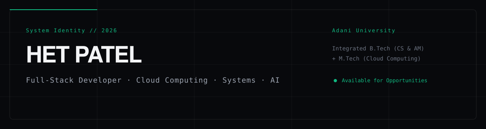

  

  
  
  
  

---

## 01 / ABOUT

**Het Patel** is an Integrated **B.Tech (Computer Science & Applied Mathematics) + M.Tech (Cloud Computing)** student at **Adani University**, Ahmedabad.

Focus areas include:
- Backend Systems Engineering
- Cloud Architecture & Deployments
- Full-Stack Web Applications
- System Design & Data Structures
- Local AI / LLM Workflow Integration

---

## 02 / SELECTED WORK

### ✦ Rentalease — Rental & Property Management SaaS
* **Type:** Flagship Production SaaS Platform
* **Live App:** [rentalease.co.in](https://rentalease.co.in/)
* **Repository:** [patelhet0507/Rental-Module](https://github.com/patelhet0507/Rental-Module)
* **Stack:** React · Firebase Authentication · Firestore · Vercel
* **Key Features:** Property and tenant directory, lease agreement lifecycle tracking, upcoming renewals, complete accounting module (invoicing, vouchers, ledgers, receivables aging), AI data analytics console, role-based access control.

---

### ✦ Kaccho Phool — Android Multiplayer Card Game
* **Type:** Android & Multiplayer Game Application
* **Live App:** [kacchooisdaphoolisda.vercel.app](https://kacchooisdaphoolisda.vercel.app/)
* **Repository:** [patelhet0507/kacchooisdaphoolisda](https://github.com/patelhet0507/kacchooisdaphoolisda)
* **Stack:** Kotlin · Jetpack Compose · Firebase RTDB
* **Team:** Het Patel, Shubham Patel, Milin Patel, Vansh Parmar, Vraj Soni, Rushi Patel, Karma Patel

---

### ✦ TransitOps — Logistics & Fleet Management
* **Type:** Odoo Hackathon Build
* **Live App:** [odoo-hackathon-wheat.vercel.app](https://odoo-hackathon-wheat.vercel.app/)
* **Repository:** [patelhet0507/odoo-hackathon](https://github.com/patelhet0507/odoo-hackathon)
* **Stack:** Django · Tailwind CSS · Chart.js · PostgreSQL / SQLite

---

### ✦ ShopEase — Full-Stack E-Commerce System
* **Type:** E-Commerce Web Application
* **Live App:** [shop-ease-final.vercel.app](https://shop-ease-final.vercel.app/)
* **Repository:** [patelhet0507/ShopEase_final](https://github.com/patelhet0507/ShopEase_final)
* **Stack:** React · FastAPI · PostgreSQL · JWT

---

### ✦ Local AI Chatbot — Privacy-First LLM Assistant
* **Type:** Local Model Inference Engine
* **Repository:** [patelhet0507/Local-AI-ChatBot](https://github.com/patelhet0507/Local-AI-ChatBot)
* **Stack:** Python · FastAPI · React · llama-cpp-python

---

## 03 / EXPERIENCE

| Organization | Role | Period / Status | Details |
| :--- | :--- | :--- | :--- |
| **Cognifyz** | Python Developer Intern | Remote · 04 Jun 2026 – 04 Jul 2026 | Python scripting and backend utility development. |
| **RatnaBhumi Developers / Ratna Group** | Full Stack Developer Intern | Remote | Built Rental & Property Agreement Management System. Mentor: Dhaval Moridhara. |
| **Technoville Consultants / Flamingo Group** | Backend Developer Intern | Remote · Completed 16 Jul 2026 | Backend operations, API services, database management. |

---

## 04 / TECHNOLOGIES

* **Languages:** Python · C++ · C · JavaScript · TypeScript · SQL
* **Frontend:** React · Next.js · HTML5 / CSS3 · Tailwind CSS
* **Backend:** FastAPI · Django · Flask · REST APIs · JWT
* **Databases:** PostgreSQL · Firestore · Firebase RTDB · SQLite
* **Cloud & Tools:** Docker · Vercel · Git · GitHub · llama.cpp

---

## 05 / ACHIEVEMENTS

- Adobe University Hackathon — Round 2 Participation
- TVS Credit Hackathon — Round 2 Participation
- Smart India Hackathon — Round 2 Application
- Microsoft Generative AI & Agents Certification
- Odoo Techfest Participation

---

## 06 / CONNECT

* **Email:** [patelhet.0507@gmail.com](mailto:patelhet.0507@gmail.com)
* **GitHub:** [github.com/patelhet0507](https://github.com/patelhet0507)
* **LinkedIn:** [linkedin.com/in/het-patel-6b2514376](https://www.linkedin.com/in/het-patel-6b2514376)
* **LeetCode:** [leetcode.com/u/patelhet0507](https://leetcode.com/u/patelhet0507)

---

**HET PATEL**  
Building software.  
Learning systems.  
Exploring what's next.  
